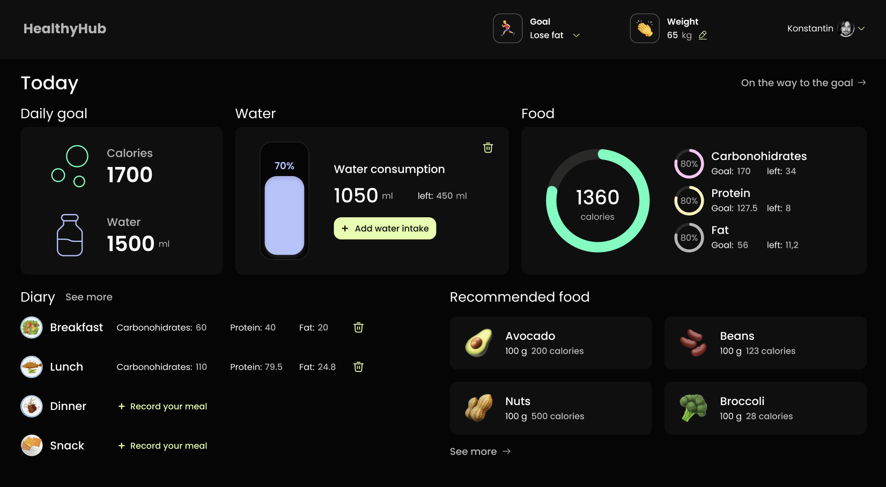
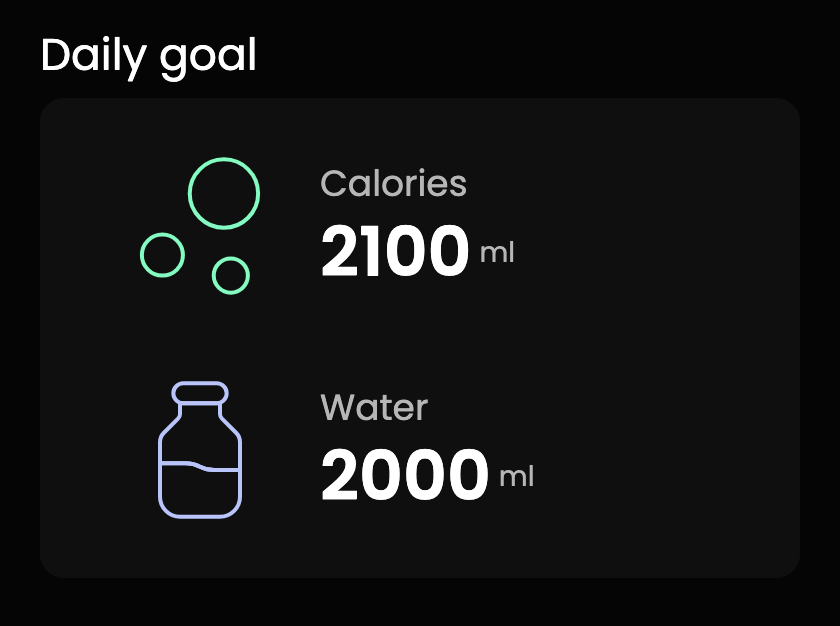
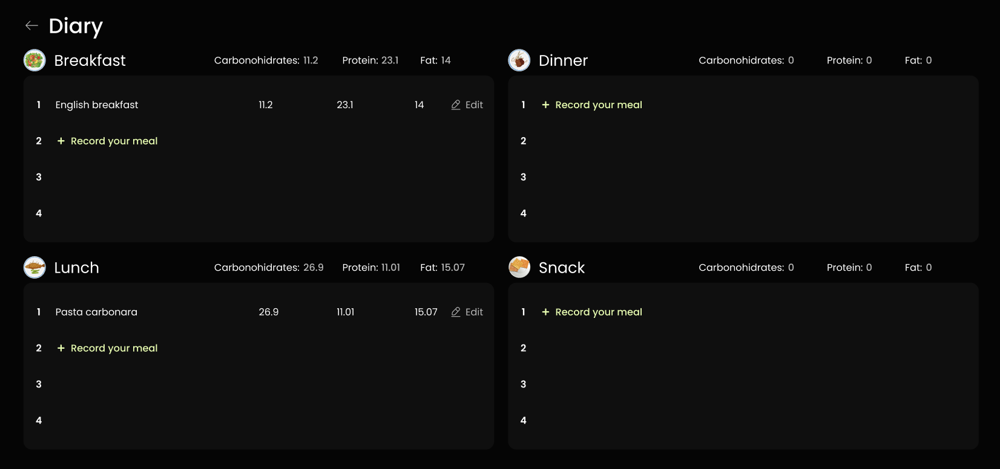

# Healthy Hub 🥬

Healthy Hub is a web application designed to help users monitor their nutrition, water intake, and weight changes. The app enables users to track their daily goals for calories, water, and nutrients, as well as maintain a food diary.

## Key Features

### Main Page (MainPage) 🏠

- Displaying blocks such as the page title, navigation elements, daily goal, water, food, diary, and recommended food.
- Responsive design for mobile, tablet, and desktop devices.

### Daily Goal (DailyGoal) 🎯

- Displaying the daily calorie and water intake goals for the user.
- Graphs to track progress in calorie and water consumption.

### Food (Food) 🍲

- Graphs depicting the distribution of nutrients (calories, carbohydrates, proteins, fats) with goal input and progress tracking.

### Water Tracker (Water) 💧

- Showing the percentage of consumed water compared to the daily goal.
- Functionality to add consumed water.

### Diary (Diary) 📓

- Recording food entries for breakfast, lunch, dinner, and snacks.
- Nutrient information and the ability to add new entries via a modal window.

### Recommended Food (RecommendedFood) 🌽

- List of recommended products with calorie and volume details.

### Dashboard Page (DashboardPage) 📊

- Graphs displaying information about calories, water, and weight changes over specific periods.
- Averages and the ability to choose a period (month).

### Diary Page (DiaryPage) 🗒️

- Section where users can record food entries for different meals.
- Display of nutrients for each meal and the ability to add new entries via a modal window.

### Recommended Food Page (RecommendedFoodPage) 🍏

- List of recommended products with details.

### Settings Page (SettingsPage) ⚙️

- Editing user profile, including photo, name, age, gender, weight, and physical activity level.
