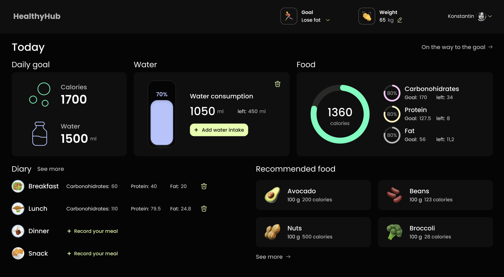
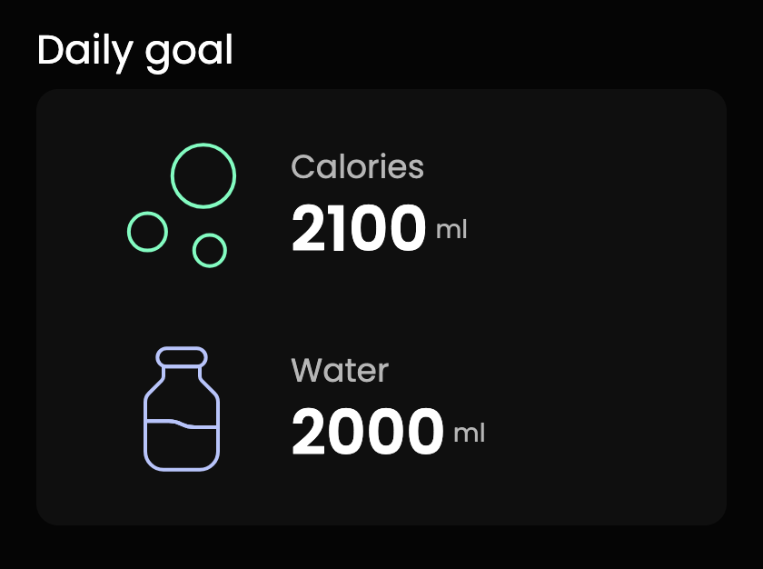
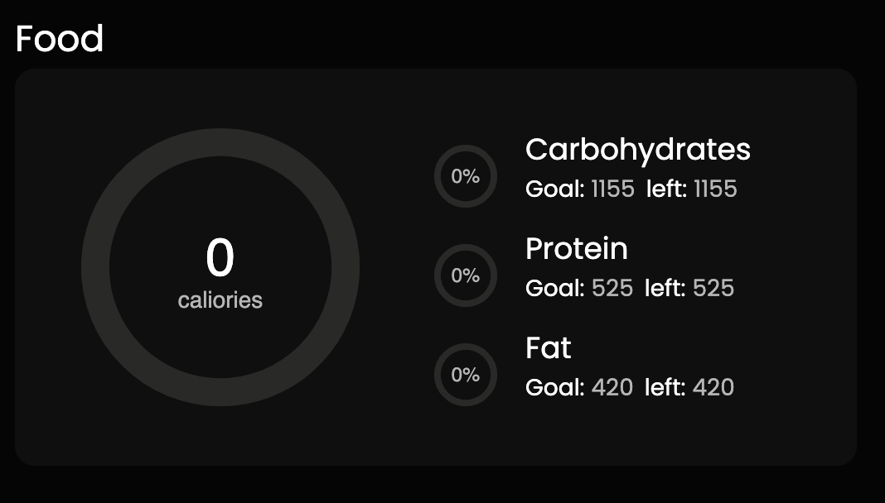
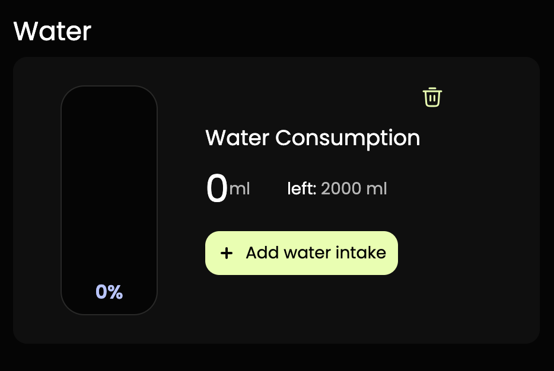
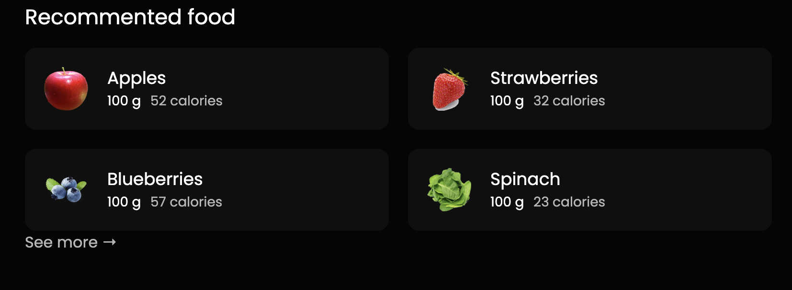
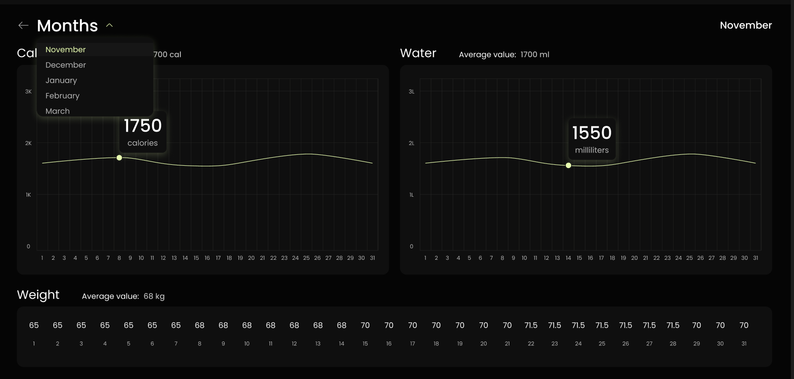
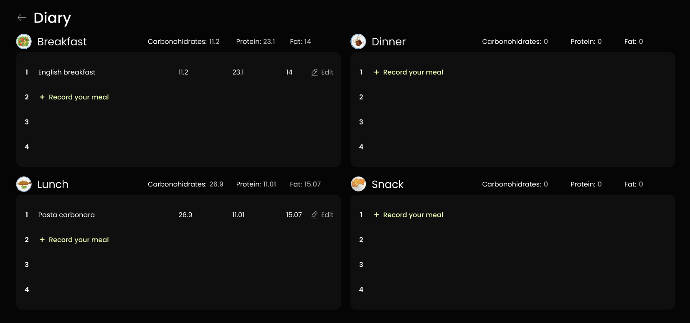
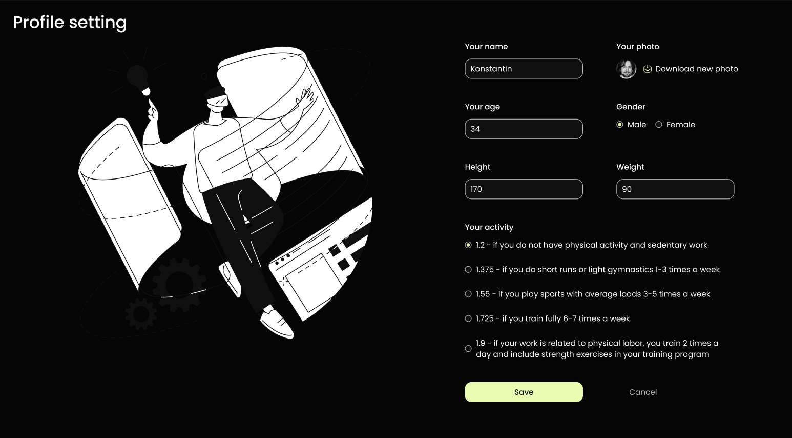

# Healhy Hub 🥬

Healhy Hub - це веб-додаток, який допомагає користувачам вести контроль за своїм харчуванням, споживанням води та змінами ваги. Додаток дозволяє користувачам стежити за своїми щоденними цілями щодо калорій, води та нутрієнтів, а також вести щоденник їжі.

## Основні функціональності

### Головна сторінка (MainPage) 🏠

- Відображення блоків, таких як заголовок сторінки, навігаційні елементи, щоденна мета, вода, їжа, щоденник та рекомендована їжа.
- Адаптація для мобільних, планшетних та десктопних пристроїв.

 

  

### Щоденна мета (DailyGoal) 🎯

- Відображення кількості калорій та води, яку користувач має споживати щоденно.
- Графіки для відстеження прогресу споживання калорій та води.

 

### Їжа (Food) 🍲

- Графіки розподілу поживних речовин (калорії, вуглеводи, білки, жири) з можливістю введення цілей та відстеження прогресу.

 

### Трекер води (Water) 💧

- Відображення відсотка випитої води в порівнянні з денною метою.
- Функціонал додавання випитої води.

### Щоденник (Diary) 📓

- Ведення записів про їжу для сніданку, обіду, вечері та перекусів.
- Інформація по нутрієнтах та можливість додавання нових записів через модальне вікно.

### Рекомендована їжа (RecommendedFood) 🌽

- Перелік рекомендованих продуктів з вказанням калорій та обсягу.

  

### Сторінка із графіками (DashboardPage) 📊

- Графіки для відображення інформації про калорії, воду та зміни ваги протягом певних періодів.
- Середні значення та можливість вибору періоду (місяць).

  

### Сторінка Щоденника (DiaryPage) 🗒️

- Розділ, де користувач може вести записи про їжу для різних прийомів.
- Відображення нутрієнтів для кожного прийому та можливість додавання нових записів через модальне вікно.

### Сторінка Рекомендованої Їжі (RecommendedFoodPage) 🍏

- Перелік рекомендованих продуктів з деталями.
  

### Сторінка Налаштувань (SettingsPage) ⚙️

- Редагування профілю користувача, включаючи фото, ім'я, вік, стать, вагу та рівень фізичної активності.
 

